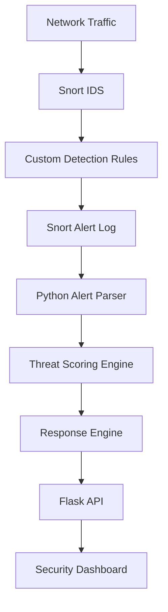

# NetSentinel
### Lightweight Network Intrusion Detection & Response System

NetSentinel is a lightweight Network Intrusion Detection and Response System (NIDS) built using **Snort 2.9.20**, custom rule-based packet detection, deterministic Python threat scoring, application-level simulated intrusion response, and a web dashboard.

---

## Overview

NetSentinel monitors network traffic for suspicious patterns using Snort, parses rule alerts into structured Python data, evaluates a 0–100 threat score and risk category, triggers application-level response policies, and presents security visibility through a web dashboard powered by Flask and Chart.js.

---

## Problem Statement

Unmonitored network traffic can harbor malicious scanning, unauthorized connection attempts, and web application attack vectors. Manually inspecting raw network logs is inefficient and fails to prioritize high-risk threats. 

NetSentinel solves this challenge by providing automated, real-time intrusion detection, deterministic threat scoring, and structured event visualization to give security analysts immediate visibility into network threat activity.

---

## Solution & Architecture

NetSentinel implements an end-to-end security pipeline:

```text
Network Traffic
      ↓
Snort IDS (2.9.20)
      ↓
Custom Detection Rules
      ↓
Python Alert Parser
      ↓
Threat Scoring Engine
      ↓
Response Engine
      ↓
Flask REST API
      ↓
Security Dashboard
```

### Mermaid System Architecture



---

## Key Features

- **Network Monitoring**: Live packet capture and rule matching using Snort 2.9.20 and Npcap.
- **Custom Rule Engine**: Tailored detection rules for ICMP scans, suspicious TCP connections, and HTTP attacks.
- **Regex Alert Parser**: High-performance extraction of timestamp, SID, priority, protocol, source/destination IP, and ports.
- **Deterministic Threat Scoring**: Transparent 0–100 scoring algorithm based on Snort priority and contextual port modifiers.
- **Risk Level Classification**: Standardized 4-tier risk categories (`LOW`, `MEDIUM`, `HIGH`, `CRITICAL`).
- **Application-Level Response Engine**: Simulated defensive actions (`LOG`, `FLAG`, `SUSPICIOUS`, `SIMULATED_BLOCK`, `ALREADY_BLOCKED`).
- **In-Memory IP Tracking**: Real-time maintenance of suspicious IP sets and simulated blocklists without database dependencies.
- **Flask REST API**: Read-only JSON endpoints (`/health`, `/api/alerts`, `/api/stats`, `/api/responses`).
- **Cybersecurity Dashboard**: Modern dark-mode web interface featuring live summary metrics, threat distribution donut chart, attack activity bar chart, and recent alert tables.
- **Auto-Refresh & Resiliency**: Automated 5-second polling loop with visual backend offline fallback indicators.

---

## Custom Detection Rules

NetSentinel uses custom detection rules loaded in `snort/rules/netsentinel.rules`:

| SID | Message | Severity | Classtype | Protocol / Target |
|:---:|---|:---:|---|---|
| **9000001** | `[NetSentinel] ICMP Activity Detected` | LOW (Priority 3) | `network-scan` | ICMP Any |
| **9000002** | `[NetSentinel] Suspicious TCP Connection Attempt on Port 4444` | MEDIUM (Priority 2) | `attempted-recon` | TCP Port 4444 |
| **9000003** | `[NetSentinel] Suspicious HTTP Test Pattern Detected` | HIGH (Priority 1) | `web-application-attack` | TCP Port 80, 8000, 8080 |

*All detection rules were validated against safe, controlled local traffic (`127.0.0.1`).*

---

## Deterministic Threat Scoring

NetSentinel employs a transparent, rule-based scoring engine in `engine/threat_score.py`. Scoring is completely deterministic and does not rely on opaque machine learning models or external APIs.

### Base Scoring Matrix

| Snort Priority | Base Score | Default Description |
|:---:|:---:|---|
| **Priority 1** | `70` | High severity alert |
| **Priority 2** | `50` | Medium severity alert |
| **Priority 3** | `30` | Low severity alert |
| **Unknown** | `20` | Default fallback |

### Context Modifiers

* **Target Port 4444 (TCP)**: `+10` points (Common reverse-shell / malware port).
* **HTTP Test Pattern (TCP)**: `+5` points (Web attack signature match).

### Risk Classification Matrix

| Score Range | Risk Level | Policy Description |
|:---:|:---:|---|
| **0 – 29** | `LOW` | Minor or informational network event |
| **30 – 59** | `MEDIUM` | Suspicious scanning or general activity |
| **60 – 79** | `HIGH` | High-priority port attempt or web pattern |
| **80 – 100** | `CRITICAL` | Severe exploit pattern or critical alert |

### Verified Rule Scoring Examples

| SID | Calculation | Score | Risk Level |
|:---:|---|:---:|:---:|
| **9000001** | Base Priority 3 (`30`) | **30** | `MEDIUM` |
| **9000002** | Base Priority 2 (`50`) + Port 4444 (`+10`) | **60** | `HIGH` |
| **9000003** | Base Priority 1 (`70`) + HTTP TCP (`+5`) | **75** | `HIGH` |

---

## Application-Level Response Engine

The Response Engine in `engine/response_engine.py` evaluates scored alerts and assigns application-level defensive actions:

| Risk Level | Response Action | Status Code | Action Taken |
|:---:|:---:|:---:|---|
| **LOW** | `LOG` | `RECORDED` | Logged into response history. |
| **MEDIUM** | `FLAG` | `FLAGGED` | Flagged for analyst monitoring. |
| **HIGH** | `SUSPICIOUS` | `MARKED_SUSPICIOUS` | Source IP added to `suspicious_ips` list. |
| **CRITICAL** | `SIMULATED_BLOCK` | `BLOCKED_SIMULATED` | Source IP added to `blocked_ips` list. |
| **CRITICAL** *(Dup)* | `ALREADY_BLOCKED` | `BLOCKED_SIMULATED` | Duplicate CRITICAL alert; IP already in blocklist. |

> **Safety Notice:** NetSentinel uses an application-level simulated response mechanism. It does not modify the operating system firewall or perform real IP blocking.

---

## Security Dashboard

The web dashboard is hosted by Flask and served from `dashboard/`:

- **Metrics Cards**: Real-time totals for Alerts, Medium Risk, High Risk, and Simulated Blocks.
- **Threat Distribution Chart**: Donut chart powered by Chart.js categorizing alerts by risk level.
- **Attack Activity Chart**: Bar chart showing detection counts by SID rule.
- **Recent Security Alerts**: Detailed tabular feed with colored risk badges.
- **Tracked Sources**: Live lists for Suspicious IPs and Simulated Blocked IPs.
- **Response Activity**: Complete audit stream of response actions taken by the engine.

### Technology Stack

* **Backend**: Python 3.13, Flask 3.1
* **Frontend**: HTML5, Vanilla CSS, JavaScript (ES6)
* **Visualization**: Chart.js 4.4 (CDN)

---

## Project Structure

```text
NetSentinel/
├── snort/
│   ├── rules/
│   │   └── netsentinel.rules        # Custom Snort detection rules
│   └── config/
│       ├── netsentinel.conf         # Snort configuration file
│       └── start_snort.ps1          # PowerShell launcher & test script
│
├── engine/
│   ├── alert_parser.py              # Snort fast-alert regex parser
│   ├── run_parser.py                # Parser demonstration script
│   ├── threat_score.py              # Deterministic 0-100 scoring engine
│   ├── run_scoring.py               # Scoring demonstration script
│   ├── response_engine.py           # Application response engine & IP tracker
│   └── run_response.py              # Full end-to-end pipeline demonstration
│
├── backend/
│   └── app.py                       # Flask REST API & dashboard static server
│
├── dashboard/
│   ├── index.html                   # Dashboard UI structure
│   ├── style.css                    # Dark cybersecurity styling & risk badges
│   └── app.js                       # Chart.js initialization & API polling loop
│
├── tests/
│   ├── test_alert_parser.py         # Unit tests for alert parser
│   ├── test_threat_score.py         # Unit tests for threat scoring logic
│   ├── test_response_engine.py      # Unit tests for response engine & safety
│   ├── test_dashboard_api.py        # Integration tests for Flask API
│   ├── test_http_server.py          # Local HTTP server for SID 9000003 testing
│   ├── run_tests.ps1                # PowerShell controlled traffic generator
│   └── attack_simulation.md         # Attack simulation evidence log
│
├── README.md                        # Project documentation
└── requirements.txt                 # Dependencies (Flask, Pytest)
```

---

## Installation & Setup Guide

### Environment Requirements

* **Operating System**: Windows 11
* **Packet Capture Driver**: Npcap (or WinPcap)
* **IDS Engine**: Snort 2.9.20 (installed at `C:\Snort`)
* **Python Runtime**: Python 3.10+

### 1. Install Dependencies

```bash
pip install -r requirements.txt
```

### 2. Validate Snort Configuration

```powershell
# Run in Administrator PowerShell
.\snort\config\start_snort.ps1 -TestMode
```

### 3. Run Automated Unit & API Tests

```bash
python -m pytest tests/ -v
```

### 4. Execute End-to-End Pipeline Demonstration

```bash
# Run full pipeline demonstration script
python engine/run_response.py
```

### 5. Launch Flask Backend & Security Dashboard

```bash
python backend/app.py
```

Open your browser and navigate to:
```text
http://127.0.0.1:5000/
```

### 6. Controlled Attack Simulation

To generate test traffic and observe live detection on the dashboard:

```powershell
# Terminal 1: Start Snort live capture
.\snort\config\start_snort.ps1

# Terminal 2: Start test HTTP server
python tests/test_http_server.py 8080

# Terminal 3: Execute controlled attack simulation
.\tests\run_tests.ps1 -Test All -TargetIP 127.0.0.1
```

---

## Automated Testing & Validation

NetSentinel includes an automated test suite covering all pipeline phases:

```bash
python -m pytest tests/ -v
```

### Test Suite Results

```text
tests/test_alert_parser.py ........ [ 19%]
tests/test_dashboard_api.py ........ [ 42%]
tests/test_response_engine.py ...... [ 71%]
tests/test_threat_score.py ........ [100%]

==================== 21 passed in 0.40s ====================
```

* **Total Tests**: 21
* **Passed**: 21
* **Failed**: 0
* **Skipped**: 0

---

## Safety & Security Guarantees

NetSentinel is designed with safety principles for demonstration and educational use:

```text
OS Firewall Modified: NO
Network Configuration Modified: NO
Real IP Blocking: NO
Shell Command Execution from Alerts: NO
```

* All network traffic testing is restricted to controlled local loopback targets (`127.0.0.1`).
* Defensive blocking is strictly simulated in-memory within the application layer.

---

## Scope & Limitations

* **Rule-Based Scope**: Intrusion detection relies on pre-configured Snort rules.
* **Deterministic Logic**: Threat scoring uses rule-based priority and port modifiers rather than machine learning.
* **Simulated Mitigation**: Response actions are maintained in-memory and do not alter operating system firewall rules.
* **In-Memory State**: Active session state is maintained in RAM for demonstration lightness (no persistent database).

---

## Future Roadmap

- Persistent SQLite database integration for historical alert archiving.
- Support for expanded Snort rule sets (Emerging Threats community rules).
- External threat-intelligence IP reputation lookups.
- Role-based authentication and user access control for the dashboard.
- Real firewall integration options with automated rollback safeguards.

---

## Final Validation & Release Status

```text
NETSENTINEL
━━━━━━━━━━━━━━━━━━━━━━━━━━━━━━
STATUS: RELEASE READY
TEST SUITE: 21/21 PASSED
GIT COMMIT: 9162192
BRANCH: main
WORKING TREE: CLEAN
━━━━━━━━━━━━━━━━━━━━━━━━━━━━━━
```
